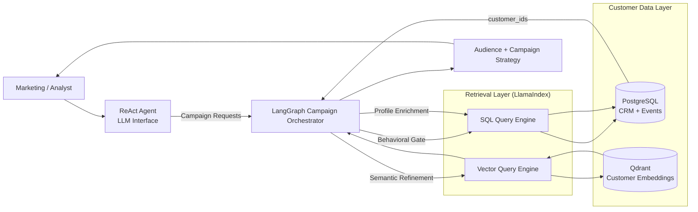
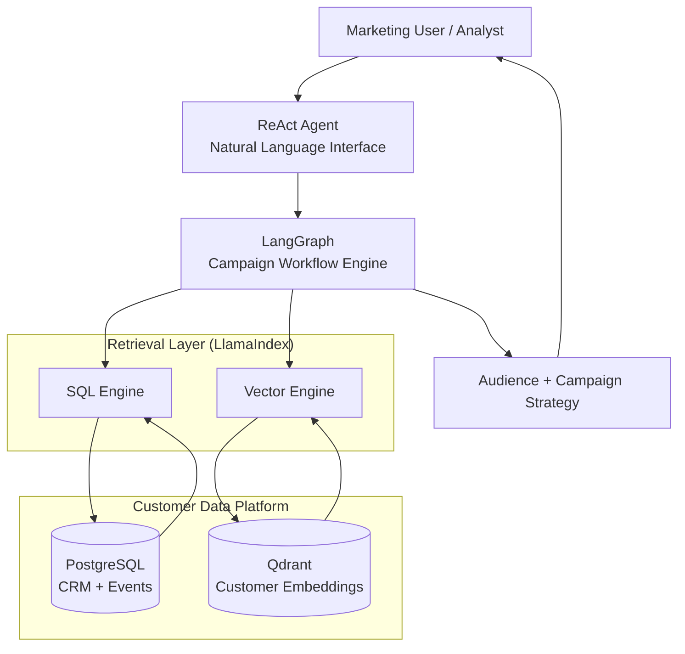

# Agentic CDP Demo — Hybrid AI Audience Discovery

This project demonstrates an **AI-powered Customer Data Platform (CDP)** that combines:

- Deterministic analytics (PostgreSQL)
- Semantic discovery (Qdrant vector search)
- LLM reasoning
- **LangGraph-based workflow orchestration**
- ReAct Agent as a conversational entrypoint

The goal is to show how modern AI systems can move CDPs from **manual, rule-based segmentation** to **intelligent, automated campaign orchestration**.

Instead of "chat with PDFs", this demo focuses on a realistic marketing use case:

> *Suggest customers for a luxury red-themed fashion campaign.*

---

## High-Level Architecture



---

## Core Concept: True Hybrid Fusion

This system implements **SQL → Vector → SQL** fusion:

1. **Behavioral SQL Gate (Postgres)**  
   Filters customers based on deterministic facts (purchases, recency, events).

2. **Semantic Refinement (Qdrant)**  
   Ranks and refines those candidates using embeddings (e.g. "luxury", "red affinity").

3. **Profile Enrichment (Postgres)**  
   Fetches full CRM profiles for activation.

This avoids hallucinated analytics while enabling fuzzy discovery.

---

## Workflow Orchestration with LangGraph

LangGraph is used as a **deterministic campaign orchestration engine**, not just an agent loop.

The workflow is:

1. Intent Classification  
2. Behavioral SQL Gate  
3. Semantic Vector Refinement  
4. Audience Validation (with optional widening / narrowing loop)  
5. Profile Enrichment  
6. Campaign Recommendation  
7. Final Output

LangGraph manages state, branching, and iteration.

The ReAct Agent is used only as the **conversational entrypoint** that delegates execution to this workflow.

LlamaIndex is used strictly as the **retrieval abstraction layer** for SQL and vector search.

---

## Example Query

"Suggest customers for a luxury red-themed fashion campaign."

Behind the scenes:

- SQL filters recent fashion buyers
- Qdrant refines luxury + red affinity
- LangGraph validates audience size
- SQL enriches profiles
- LLM generates campaign recommendations

---

## Project Structure

```
.
├── agent.py        # ReAct Agent (user interaction + routing)
├── engine.py       # LangGraph campaign workflow (core orchestration)
├── ingest.py       # Data ingestion into Postgres + Qdrant
├── cli.py          # CLI interface
├── config.py       # Environment + model configuration
├── main.py        # Entry point
└── README.md
```

---

## Available Tools

The ReAct agent uses the following specialized tools to interact with the CDP:

- **`sql_analytics`**: Translates natural language to SQL for deterministic CRM analysis (counts, sums, averages).
- **`discovery_expert_pipeline`**: An autonomous multi-step pipeline for building full campaign strategies, including audience refinement and validation.
- **`hybrid_discovery`**: Combines behavioral SQL filtering with semantic vector search for exploratory audience discovery.
- **`sql_data_retriever`**: Fetches detailed JSON customer profiles once segments are identified.

---

## Technology Stack

- LLM: OpenRouter-compatible models (Gemini / GPT / Claude)
- Workflow Orchestration: LangGraph
- Retrieval Layer: LlamaIndex
- Relational DB: PostgreSQL
- Vector DB: Qdrant
- Embeddings: SentenceTransformers / HuggingFace

---

## Why This Matters

Traditional composable CDPs rely on manual SQL segmentation and static rules.

This demo shows how:

- LLMs
- Agents
- Hybrid retrieval
- Stateful workflows

can dramatically speed up campaign creation and elevate CDPs into **intelligent journey orchestration platforms**.

AI doesn’t replace CDPs — it makes them faster and smarter.

---

## ⚠️ Demo Disclaimer

This project uses synthetic data and LLM-generated SQL for demonstration purposes.

In production systems, SQL generation would be replaced with validated templates or DSLs, and governance, permissions, and cost controls would be mandatory.

---

## Future Work

- Role-based access control
- Cost tracking per workflow
- Evaluation metrics
- Campaign activation APIs
- Governance & permissions

---

Built as a learning project for hybrid AI system design and agentic workflow orchestration.


---

## High-Level Component Diagram



This diagram shows the major system components and their responsibilities:

- **ReAct Agent** – conversational entrypoint for marketers and analysts  
- **LangGraph** – deterministic workflow orchestration (campaign logic, validation loops)  
- **LlamaIndex** – retrieval abstraction for SQL and vector search  
- **PostgreSQL** – system of record for CRM + behavioral events  
- **Qdrant** – semantic customer profiles for intent-based discovery  

---

# output examples

- **Audience**: audience.json
- **Campaign**: campaign.md